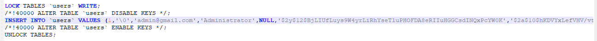
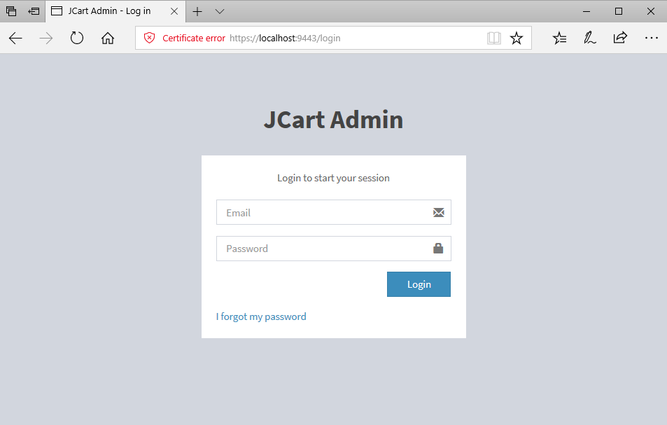
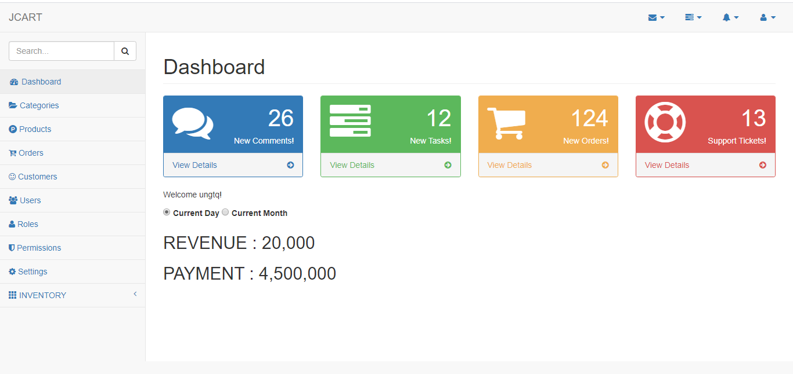
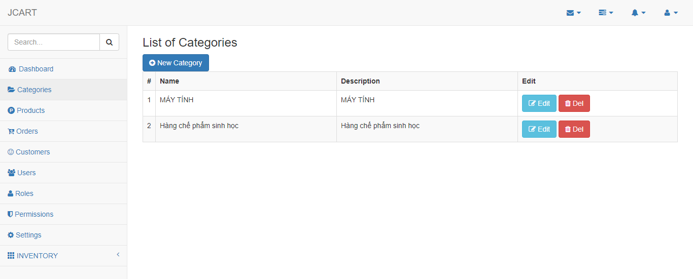
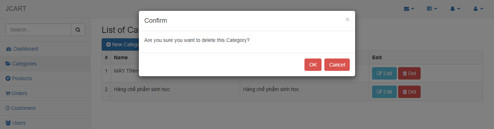
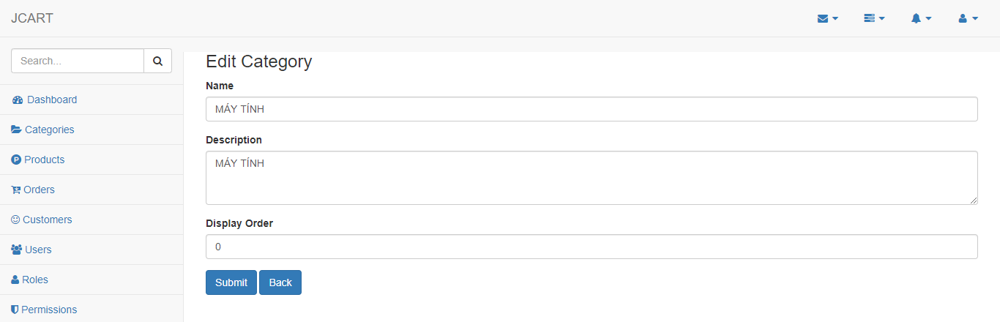
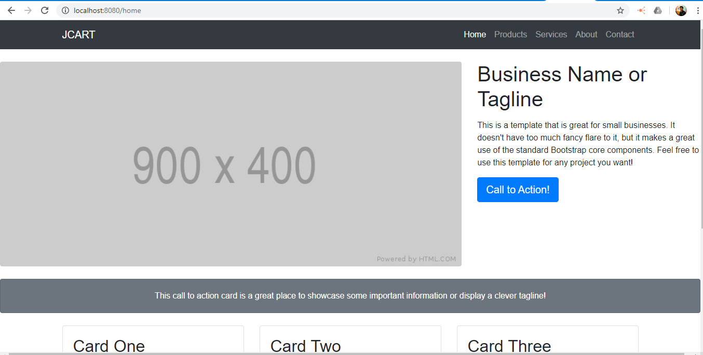

# JCART - This is a simple e-commerce application built with Spring.
You should referrence in this -> https://github.com/sivaprasadreddy/jcart

Again I want to thank you for Mr.Sivaprasadreddy

My email: ungtq0805@gmail.com

**Technologies:** SpringBoot, Spring Data JPA, Spring Security, Bootstrap, Thymeleaf, MySQL, Log4j2, Junit, Mockito, Java Coding Coverage.

**Implementing contents:**
- Connect with MySQL DB (Done)
- Make a sequence and add it into entities (Sample with Category Entity) (Done)
- Add waiting windows for processing (Done)
- Create my_account page and change password for user (Done)
- Login with UserName (Done)
- Multilanguages with Vietnamese - Japanese (Demo - 10%)
- Warehouse management
- Permission with INFLOW (with apply person and approve person), the idea base on WORKFLOW systems.
- Pagination

**ADMIN SITE** 

You should use sql-scripts/dump.sql to dump data and get the user to login

Use the URL **https://localhost:9443** to connect

Login information 

**user**     : **ungtq** 

**password** : **P@ss0805**. 

And you should look like below screen Home for Administrator

This is category screens

**GLOBAL SITE**

Use the URL **http://localhost:8080** to connect

And you should look like below screen Home for Global Site

This is Product screens

